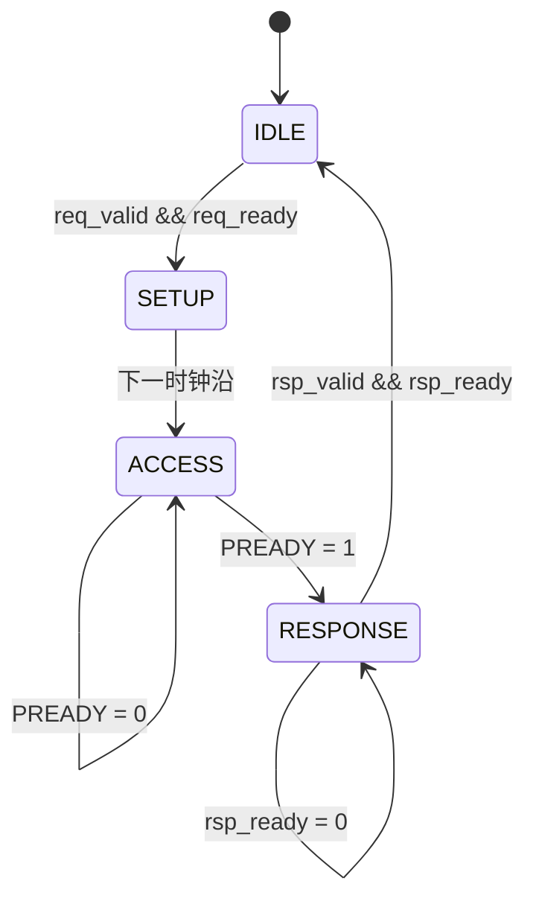

# AXI5-Lite 到 APB4 桥电路待测RTL说明

桥采用同一个时钟、32 位地址和 32 位数据。AXI 主控提交请求，AXI 子模块缓存并仲裁请求，APB 子模块访问外部寄存器，再由 AXI 子模块返回响应。

## 1. 协议版本与文件

实现**AXI5-Lite 从接口**。APB 按照 IHI 0024C 文档实现 **APB4 主接口**。

| 协议依据 | 本实现采用的内容 |
| --- | --- |
| `IHI0022G_amba_axi_protocol_spec(1).pdf`，Part A / Part C，尤其 C2.6、C2.7 | 通道握手、AXI5-Lite 单拍传输、ID 返回、SIZE 与写 strobe |
| `IHI0024C_amba_apb_protocol_v2_0_spec(1).pdf`，1.2.3、3.2、3.4、Chapter 4 | APB4 的 PPROT/PSTRB、等待、错误响应与 SETUP/ACCESS 状态 |

| 文件 | 作用 |
| --- | --- |
| `axi4_lite_slave.v` | AXI5-Lite 从接口；为保持原顶层的实例化名称，保留 `axi4_lite_slave` 模块名 |
| `apb_master.v` | APB4 主接口，模块名为 `apb_master` |
| `axilite2apb.v` | 配套顶层，只扩展必要的 AXI5-Lite 端口和连接 |

AXI5-Lite 本身是单拍接口。本实现选择按序返回响应，最多缓存一个写请求和一个读请求，并依次访问 APB。AXI5 的突发、原子操作以及可选的唤醒、毒化、校验、跟踪接口不在本接口配置中。

## 3. AXI 从接口怎样工作

AW、W、AR 各有一个缓存槽。只有相应 `VALID && READY` 的时钟上升沿才捕获输入：

- AW 槽保存地址、保护属性、ID 和 SIZE。
- W 槽保存数据和 WSTRB。
- AR 槽保存读地址、保护属性、ID 和 SIZE。

写地址与写数据可以同时到达，也可以任一先到。两者都被接收后，才有完整的写请求。主控在握手后改变总线输入，不会改变已缓存的访问内容。

内部处理分为 `FRONT_IDLE、FRONT_ISSUE、FRONT_WAIT`：

1. `FRONT_IDLE` 选择一个完整请求；读写都在等待时轮流优先。
2. `FRONT_ISSUE` 置位 `req_valid`，保持请求字段，等 `req_ready`。
3. `FRONT_WAIT` 等待 `rsp_valid && rsp_ready`，把结果写入 B 或 R 响应寄存器。

写响应携带缓存的 AWID，读响应携带缓存的 ARID；ID 无需送到 APB，因为 APB 一次执行一个访问，AXI 子模块始终保留当前请求的元信息。

`BREADY=0` 时保持 `BVALID/BRESP/BID`；`RREADY=0` 时保持 `RVALID/RDATA/RRESP/RID`。只有响应握手后，才释放同类请求的缓存槽。这保证主控暂时不接收结果时不会丢失响应。

读和写使用独立响应槽。写响应受阻期间，仍可处理读请求；读响应受阻期间，仍可处理写请求。同地址的并发读写由实际仲裁顺序决定，若需要确定读到写后的值，应先接收写响应再发出读请求。

## 4. SIZE、地址和字节写入

`AxSIZE` 表示每次访问的字节数为 `2^AxSIZE`。32 位总线支持以下编码：

| SIZE | 字节数 | 访问类型 |
| --- | --- | --- |
| `3'b000` | 1 | 字节 |
| `3'b001` | 2 | 半字 |
| `3'b010` | 4 | 整字 |

桥访问包含目标字节的 32 位 APB 寄存器，即 `PADDR = AxADDR & 32'hFFFF_FFFC`。低两位表示寄存器内的字节位置，高位地址保持不变。

写操作通过 `WSTRB → PSTRB` 选择实际更新的字节，不自动移动 WDATA。主控应把数据放到对应的字节 lane，并提供符合地址和 SIZE 的 WSTRB：

| AXI 地址 | AWSIZE | WDATA 示例 | WSTRB | APB 地址 | 写入效果 |
| --- | --- | --- | --- | --- | --- |
| `0x01` | `000` | `0x0000_AA00` | `0010` | `0x00` | 更新寄存器 `[15:8]` |
| `0x02` | `001` | `0xBEEF_0000` | `1100` | `0x00` | 更新寄存器 `[31:16]` |
| `0x04` | `010` | `0x1234_5678` | `1111` | `0x04` | 更新整个寄存器 |

全零 WSTRB 也被接受，并转成全零 PSTRB 的 APB 写；支持 strobe 的从设备应保持全部字节不变。

读操作返回整个 32 位寄存器，不将目标字节右移到最低位。例如 `ARADDR=0x03、ARSIZE=000` 时，目标字节位于 `RDATA[31:24]`。IHI 0022G 的 C2.6 允许从设备在窄读时继续驱动全宽数据。

对超过 32 位总线宽度的 `SIZE=3..7`，本实现直接返回 `SLVERR`，同时返回正确的 ID，不发起 APB 访问。主控仍应生成符合 AXI5-Lite 协议的合法请求。

## 5. APB 主接口怎样工作

APB 总线按照标准的 `IDLE → SETUP → ACCESS` 工作；模块还增加一个内部 `APB_RESPONSE` 状态保存完成结果。这个状态在 APB 引脚上表现为空闲，不是新的 APB 传输阶段。

SETUP 中 `PSEL=1、PENABLE=0`，恰好持续一拍。ACCESS 中 `PSEL=1、PENABLE=1`；`PREADY=0` 时持续等待，并保持地址、方向、保护属性、数据和 strobe 不变。读访问的 PSTRB 固定为 0。

只有 `PSEL && PENABLE && PREADY` 同时为 1 的上升沿才采样 PRDATA、PSLVERR。等待期间的 PSLVERR 不参与错误判定。

采样后进入内部 RESPONSE 状态，拉低 PSEL/PENABLE，保持 `rsp_valid/rsp_rdata/rsp_error`，直到 AXI 子模块通过 rsp_ready 接收。返回结果尚未被接收时，不接收下一请求，避免覆盖结果。

## 6. 响应、复位和外部接线

| 完成情况 | AXI 响应 |
| --- | --- |
| APB 完成且 PSLVERR=0 | `OKAY = 2'b00` |
| APB 完成且 PSLVERR=1 | `SLVERR = 2'b10` |
| SIZE 超过总线宽度 | 本地 `SLVERR = 2'b10`，不访问 APB |

APB 出错时，读数据不能作为有效业务数据使用。地址译码、寄存器存储及非法地址的 PSLVERR 由外部 APB 从设备或译码器产生；本桥没有内置寄存器、地址窗口或多个外设片选。

外部 APB 从设备的时钟接 `aclk`，复位接 `aresetn`，其他同名 APB 信号与顶层 `m_apb_*` 一一连接。复位低有效，异步置位，释放应同步到时钟。

复位清除请求缓存、响应寄存器以及当前 APB 状态。已经在从设备中完成的写操作不会由桥回滚，因此桥和从设备应使用协调的复位策略。桥不提供跨时钟域处理，也不设置 PREADY 等待超时。

| 检查 | 结果 |
| --- | --- |
| 原顶层的端口名、方向、位宽与实例名对照 | 原有接口保留，只新增六个 AXI 端口 |
| 三文件联合编译，ID_WIDTH=1/4/8 | 通过，RTL 编译无警告 |
| ID_WIDTH=4，五个随机种子 | 每次 14 组检查全部通过 |
| ID_WIDTH=1、8，各一次功能仿真 | 每次 14 组检查全部通过 |
| APB 子模块独立响应反压检查 | 等待期间不提前完成，rsp_ready=0 保持结果，不接受覆盖请求 |

14 组检查覆盖复位空闲、AW/W 两种先后顺序及同时到达、寄存器写读、ID 返回、全部 16 种写 strobe、0/1/5 拍 APB 等待、等待期间错误信号干扰、完成周期错误返回、读写并发与响应反压、下一请求保持 VALID、8/16/32 位窄访问、SIZE 越界和多个阶段中复位。每次还包含 200 次随机写、200 次并发随机读、最终寄存器遍历和请求/响应计数一致性检查。

每次联合仿真完成 258 次 APB 写和 276 次 APB 读；SIZE 越界的本地响应不计入 APB 访问次数。VCS 命令已按你的工具习惯提供，本环境未实际运行 VCS。
